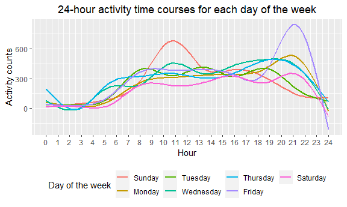

p8105_hw3_yf2605
================
Yi_Fang
2022-10-09

# Setting

libraries

``` r
library(tidyverse)
```

    ## ── Attaching packages ─────────────────────────────────────── tidyverse 1.3.2 ──
    ## ✔ ggplot2 3.3.6      ✔ purrr   0.3.4 
    ## ✔ tibble  3.1.8      ✔ dplyr   1.0.10
    ## ✔ tidyr   1.2.0      ✔ stringr 1.4.1 
    ## ✔ readr   2.1.2      ✔ forcats 0.5.2 
    ## ── Conflicts ────────────────────────────────────────── tidyverse_conflicts() ──
    ## ✖ dplyr::filter() masks stats::filter()
    ## ✖ dplyr::lag()    masks stats::lag()

``` r
library(p8105.datasets)
```

picture display setting

``` r
knitr::opts_chunk$set(
  fig.width = 6,
  fig.asp = .6,
  out.width = "90%"
)
```

# Problem 1

## load Instacart data

``` r
data("instacart")
```

## Description:

The Instacart dataset contains 15 variables and 1384617 records.

The variables include: \* order_id, product_id, add_to_cart_order,
reordered, user_id, eval_set, order_number, order_dow,
order_hour_of_day, days_since_prior_order, product_name, aisle_id,
department_id, aisle, department

## Questions:

-   How many aisles are there, and which aisles are the most items
    ordered from?

``` r
n_aisles = 
  instacart %>% 
  distinct(aisle) %>% 
  nrow()

most_item_aisle = 
  instacart %>% 
  group_by(aisle) %>% 
  summarize(n_items = n()) %>% 
  slice(which.max(n_items))
```

134 aisles are there, and fresh vegetables aisle is where the most items
ordered from.

-   Make a plot that shows the number of items ordered in each aisle,
    limiting this to aisles with more than 10000 items ordered. Arrange
    aisles sensibly, and organize your plot so others can read it.

``` r
instacart %>% 
  group_by(aisle) %>% 
  summarize(n_items = n()) %>% 
  filter(n_items > 10000) %>% 
  mutate(aisle = forcats::fct_reorder(aisle, n_items)) %>% 
  ggplot(aes(x = aisle, y = n_items)) +
  geom_col() +
  labs(
    title = "Number of items ordered in each aisle",
    x = "Aisle",
    y = "Number of items ordered",
    caption = "Only show aisles with more than 10000 items ordered"
  )+
  theme(
    plot.title = element_text(hjust = 0.5),
    axis.text.x = element_text(angle = 90, vjust = 0.5, hjust=1)
    )
```


-   Make a table showing the three most popular items in each of the
    aisles “baking ingredients”, “dog food care”, and “packaged
    vegetables fruits”. Include the number of times each item is ordered
    in your table.

``` r
instacart %>% 
  group_by(aisle, product_name) %>% 
  summarize(n_items = n()) %>% 
  filter(aisle %in% c('baking ingredients', 'dog food care', 'packaged vegetables fruits')) %>% 
  arrange(desc(n_items)) %>% 
  slice(1:3) %>%
  knitr::kable()
```

    ## `summarise()` has grouped output by 'aisle'. You can override using the
    ## `.groups` argument.

| aisle                      | product_name                                  | n_items |
|:---------------------------|:----------------------------------------------|--------:|
| baking ingredients         | Light Brown Sugar                             |     499 |
| baking ingredients         | Pure Baking Soda                              |     387 |
| baking ingredients         | Cane Sugar                                    |     336 |
| dog food care              | Snack Sticks Chicken & Rice Recipe Dog Treats |      30 |
| dog food care              | Organix Chicken & Brown Rice Recipe           |      28 |
| dog food care              | Small Dog Biscuits                            |      26 |
| packaged vegetables fruits | Organic Baby Spinach                          |    9784 |
| packaged vegetables fruits | Organic Raspberries                           |    5546 |
| packaged vegetables fruits | Organic Blueberries                           |    4966 |

-   Make a table showing the mean hour of the day at which Pink Lady
    Apples and Coffee Ice Cream are ordered on each day of the week;
    format this table for human readers (i.e. produce a 2 x 7 table).

``` r
instacart %>% 
  group_by(order_dow, product_name) %>% 
  summarize(mean_hour = mean(order_hour_of_day, na.rm=TRUE)) %>% 
  filter(product_name %in% c('Pink Lady Apples', 'Coffee Ice Cream')) %>% 
  pivot_wider(
    names_from = order_dow,
    values_from = mean_hour
  ) %>% 
  knitr::kable(digits = 2)
```

    ## `summarise()` has grouped output by 'order_dow'. You can override using the
    ## `.groups` argument.

| product_name     |     0 |     1 |     2 |     3 |     4 |     5 |     6 |
|:-----------------|------:|------:|------:|------:|------:|------:|------:|
| Coffee Ice Cream | 13.77 | 14.32 | 15.38 | 15.32 | 15.22 | 12.26 | 13.83 |
| Pink Lady Apples | 13.44 | 11.36 | 11.70 | 14.25 | 11.55 | 12.78 | 11.94 |

# Problem 2

## read and tidy the accel data set

-   read the data set
-   clean variable names
-   convert variables: activity_1-activity_1440 into longer version
-   add factor variable: weekend, 1 for weekend, 0 for weekday
-   convert variable: day as factor variable
-   convert variables: minute_from_midnight as integer

``` r
accel = 
  read_csv(file = 'data/accel_data.csv') %>% 
  janitor::clean_names() %>% 
  pivot_longer(
    activity_1:activity_1440,
    names_to = 'minute_from_midnight',
    names_prefix = 'activity_',
    values_to = 'activity_counts'
  ) %>% 
  mutate(
    weekend = as.factor(if_else(day %in% c('Saturday', 'Sunday'), 1, 0)),
    day = factor(day, levels=c('Sunday', 'Monday', 'Tuesday', 'Wednesday', 
                               'Thursday', 'Friday', 'Saturday')),
    minute_from_midnight = as.integer(minute_from_midnight),
    )
```

    ## Rows: 35 Columns: 1443
    ## ── Column specification ────────────────────────────────────────────────────────
    ## Delimiter: ","
    ## chr    (1): day
    ## dbl (1442): week, day_id, activity.1, activity.2, activity.3, activity.4, ac...
    ## 
    ## ℹ Use `spec()` to retrieve the full column specification for this data.
    ## ℹ Specify the column types or set `show_col_types = FALSE` to quiet this message.

## Description

The accel data set contains 6 variables and 50400 records.

The variables include:

-   week, day_id, day, minute_from_midnight, activity_counts, weekend

## Questions

\*Traditional analyses of accelerometer data focus on the total activity
over the day. Using your tidied dataset, aggregate across minutes to
create a total activity variable for each day, and create a table
showing these totals. Are any trends apparent?

-   calculate total activity counts for each day
-   make a table

``` r
total_activity = 
  accel %>% 
  group_by(week, day) %>% 
  summarize(
    total_activity = sum(activity_counts)
  )
```

    ## `summarise()` has grouped output by 'week'. You can override using the
    ## `.groups` argument.

``` r
total_activity %>% 
  pivot_wider(
    names_from = day,
    values_from = total_activity
  ) %>% 
  knitr::kable(digits = 2)
```

| week | Sunday |    Monday |  Tuesday | Wednesday | Thursday |   Friday | Saturday |
|-----:|-------:|----------:|---------:|----------:|---------:|---------:|---------:|
|    1 | 631105 |  78828.07 | 307094.2 |    340115 | 355923.6 | 480542.6 |   376254 |
|    2 | 422018 | 295431.00 | 423245.0 |    440962 | 474048.0 | 568839.0 |   607175 |
|    3 | 467052 | 685910.00 | 381507.0 |    468869 | 371230.0 | 467420.0 |   382928 |
|    4 | 260617 | 409450.00 | 319568.0 |    434460 | 340291.0 | 154049.0 |     1440 |
|    5 | 138421 | 389080.00 | 367824.0 |    445366 | 549658.0 | 620860.0 |     1440 |

Trends:

No apparent trends.

-   Accelerometer data allows the inspection activity over the course of
    the day. Make a single-panel plot that shows the 24-hour activity
    time courses for each day and use color to indicate day of the week.
    Describe in words any patterns or conclusions you can make based on
    this graph.

``` r
accel %>% 
  ggplot(aes(x = minute_from_midnight, y = activity_counts, color = day)) +
  geom_smooth(se = FALSE) +
  scale_x_continuous(
    breaks = seq(0, 1440, by = 60),
    labels = seq(0, 24)
    ) +
  labs(
    title = "24-hour activity time courses for each day",
    x = "Hour",
    y = "Activity counts",
    color='Day of the week'
  )+
  theme(
    legend.position = "bottom", 
    plot.title = element_text(hjust = 0.5)
    )
```

    ## `geom_smooth()` using method = 'gam' and formula 'y ~ s(x, bs = "cs")'



conclusions:

-   Most activities are carried out between 8:00 to 23:00.

-   There is one peak of activity on Sundays and one on Fridays.

-   On Sundays the activity peak is between 10:00-11:00 and on Fridays
    it is between 20:00-22:00.

# Problem 3

## Load data

``` r
data("ny_noaa")
```

## Description

The goal is to do some exploration of this dataset. To that end, write a
short description of the dataset, noting the size and structure of the
data, describing some key variables, and indicating the extent to which
missing data is an issue. Then, do or answer the following (commenting
on the results of each):

The accel data set contains 7 variables and 2595176 records.

The variables include:

-   id, date, prcp, snow, snwd, tmax, tmin

Missing data:

-   5.62 % of prcp is missing.
-   14.69 % of snow is missing.
-   22.8 % of snwd is missing.
-   43.71 % of tmax is missing.
-   43.71 % of tmin is missing.

Do some data cleaning. Create separate variables for year, month, and
day. Ensure observations for temperature, precipitation, and snowfall
are given in reasonable units. For snowfall, what are the most commonly
observed values? Why? Make a two-panel plot showing the average max
temperature in January and in July in each station across years. Is
there any observable / interpretable structure? Any outliers? Make a
two-panel plot showing (i) tmax vs tmin for the full dataset (note that
a scatterplot may not be the best option); and (ii) make a plot showing
the distribution of snowfall values greater than 0 and less than 100
separately by year.
