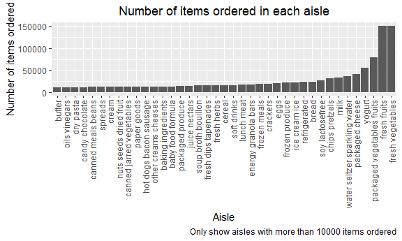
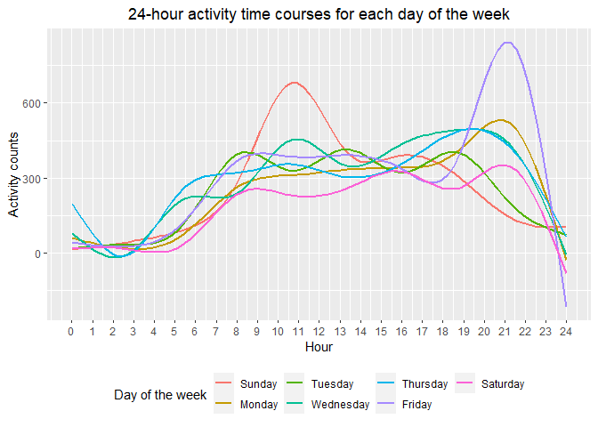
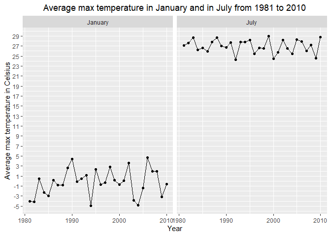
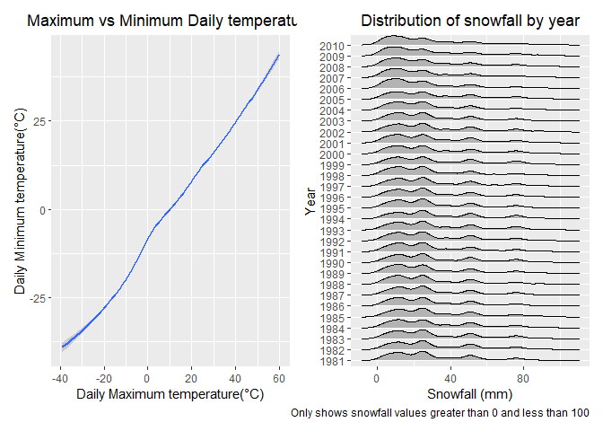

p8105_hw3_yf2605
================
Yi_Fang
2022-10-09

# Setting

libraries

``` r
library(tidyverse)
```

    ## ── Attaching packages ─────────────────────────────────────── tidyverse 1.3.2 ──
    ## ✔ ggplot2 3.3.6      ✔ purrr   0.3.4 
    ## ✔ tibble  3.1.8      ✔ dplyr   1.0.10
    ## ✔ tidyr   1.2.0      ✔ stringr 1.4.1 
    ## ✔ readr   2.1.2      ✔ forcats 0.5.2 
    ## ── Conflicts ────────────────────────────────────────── tidyverse_conflicts() ──
    ## ✖ dplyr::filter() masks stats::filter()
    ## ✖ dplyr::lag()    masks stats::lag()

``` r
library(p8105.datasets)
library(patchwork)
library(ggridges)
```

# Problem 1

## load Instacart data

``` r
data("instacart")
```

## Description:

The Instacart dataset contains 15 variables and 1384617 records.

The variables include:

-   order_id, product_id, add_to_cart_order, reordered, user_id,
    eval_set, order_number, order_dow, order_hour_of_day,
    days_since_prior_order, product_name, aisle_id, department_id,
    aisle, department

code:

-   `order_id`: order identifier
-   `product_id`: product identifier
-   `add_to_cart_order`: order in which each product was added to cart
-   `reordered`: 1 if this prodcut has been ordered by this user in the
    past, 0 otherwise
-   `user_id`: customer identifier
-   `eval_set`: which evaluation set this order belongs in (Note that
    the data for use in this class is exclusively from \* the “train”
    eval_set)
-   `order_number`: the order sequence number for this user (1=first,
    n=nth)
-   `order_dow`: the day of the week on which the order was placed
-   `order_hour_of_day`: the hour of the day on which the order was
    placed
-   `days_since_prior_order`: days since the last order, capped at 30,
    NA if order_number=1
-   `product_name`: name of the product
-   `aisle_id`: aisle identifier
-   `department_id`: department identifier
-   `aisle`: the name of the aisle
-   `department`: the name of the department

summary:

``` r
summary(instacart) %>% 
  knitr::kable()
```

|     | order_id        | product_id    | add_to_cart_order | reordered      | user_id        | eval_set         | order_number   | order_dow     | order_hour_of_day | days_since_prior_order | product_name     | aisle_id      | department_id | aisle            | department       |
|:----|:----------------|:--------------|:------------------|:---------------|:---------------|:-----------------|:---------------|:--------------|:------------------|:-----------------------|:-----------------|:--------------|:--------------|:-----------------|:-----------------|
|     | Min. : 1        | Min. : 1      | Min. : 1.000      | Min. :0.0000   | Min. : 1       | Length:1384617   | Min. : 4.00    | Min. :0.000   | Min. : 0.00       | Min. : 0.00            | Length:1384617   | Min. : 1.0    | Min. : 1.00   | Length:1384617   | Length:1384617   |
|     | 1st Qu.: 843370 | 1st Qu.:13380 | 1st Qu.: 3.000    | 1st Qu.:0.0000 | 1st Qu.: 51732 | Class :character | 1st Qu.: 6.00  | 1st Qu.:1.000 | 1st Qu.:10.00     | 1st Qu.: 7.00          | Class :character | 1st Qu.: 31.0 | 1st Qu.: 4.00 | Class :character | Class :character |
|     | Median :1701880 | Median :25298 | Median : 7.000    | Median :1.0000 | Median :102933 | Mode :character  | Median : 11.00 | Median :3.000 | Median :14.00     | Median :15.00          | Mode :character  | Median : 83.0 | Median : 8.00 | Mode :character  | Mode :character  |
|     | Mean :1706298   | Mean :25556   | Mean : 8.758      | Mean :0.5986   | Mean :103113   | NA               | Mean : 17.09   | Mean :2.701   | Mean :13.58       | Mean :17.07            | NA               | Mean : 71.3   | Mean : 9.84   | NA               | NA               |
|     | 3rd Qu.:2568023 | 3rd Qu.:37940 | 3rd Qu.:12.000    | 3rd Qu.:1.0000 | 3rd Qu.:154959 | NA               | 3rd Qu.: 21.00 | 3rd Qu.:5.000 | 3rd Qu.:17.00     | 3rd Qu.:30.00          | NA               | 3rd Qu.:107.0 | 3rd Qu.:16.00 | NA               | NA               |
|     | Max. :3421070   | Max. :49688   | Max. :80.000      | Max. :1.0000   | Max. :206209   | NA               | Max. :100.00   | Max. :6.000   | Max. :23.00       | Max. :30.00            | NA               | Max. :134.0   | Max. :21.00   | NA               | NA               |

## Questions:

### How many aisles are there, and which aisles are the most items ordered from?

``` r
n_aisles = 
  instacart %>% 
  distinct(aisle) %>% 
  nrow()

most_item_aisle = 
  instacart %>% 
  group_by(aisle) %>% 
  summarize(n_items = n()) %>% 
  arrange(desc(n_items)) %>% 
  slice(1:4)
```

134 aisles are there, and fresh vegetables, fresh fruits, packaged
vegetables fruits, yogurt aisles are where the most items ordered from.

### Make a plot that shows the number of items ordered in each aisle, limiting this to aisles with more than 10000 items ordered. Arrange aisles sensibly, and organize your plot so others can read it.

``` r
instacart %>% 
  group_by(aisle) %>% 
  summarize(n_items = n()) %>% 
  filter(n_items > 10000) %>% 
  mutate(aisle = forcats::fct_reorder(aisle, n_items)) %>% 
  ggplot(aes(x = aisle, y = n_items)) +
  geom_col() +
  labs(
    title = "Number of items ordered in each aisle",
    x = "Aisle",
    y = "Number of items ordered",
    caption = "Only show aisles with more than 10000 items ordered"
  )+
  theme(
    plot.title = element_text(hjust = 0.5),
    axis.text.x = element_text(angle = 90, vjust = 0.5, hjust=1)
    )
```

<!-- -->

### Make a table showing the three most popular items in each of the aisles “baking ingredients”, “dog food care”, and “packaged vegetables fruits”. Include the number of times each item is ordered in your table.

``` r
instacart %>% 
  group_by(aisle, product_name) %>% 
  summarize(n_items = n()) %>% 
  filter(aisle %in% c('baking ingredients', 'dog food care', 'packaged vegetables fruits')) %>% 
  arrange(desc(n_items)) %>% 
  slice(1:3) %>%
  knitr::kable()
```

    ## `summarise()` has grouped output by 'aisle'. You can override using the
    ## `.groups` argument.

| aisle                      | product_name                                  | n_items |
|:---------------------------|:----------------------------------------------|--------:|
| baking ingredients         | Light Brown Sugar                             |     499 |
| baking ingredients         | Pure Baking Soda                              |     387 |
| baking ingredients         | Cane Sugar                                    |     336 |
| dog food care              | Snack Sticks Chicken & Rice Recipe Dog Treats |      30 |
| dog food care              | Organix Chicken & Brown Rice Recipe           |      28 |
| dog food care              | Small Dog Biscuits                            |      26 |
| packaged vegetables fruits | Organic Baby Spinach                          |    9784 |
| packaged vegetables fruits | Organic Raspberries                           |    5546 |
| packaged vegetables fruits | Organic Blueberries                           |    4966 |

### Make a table showing the mean hour of the day at which Pink Lady Apples and Coffee Ice Cream are ordered on each day of the week; format this table for human readers (i.e. produce a 2 x 7 table).

``` r
instacart %>% 
  group_by(order_dow, product_name) %>% 
  summarize(mean_hour = mean(order_hour_of_day, na.rm=TRUE)) %>% 
  filter(product_name %in% c('Pink Lady Apples', 'Coffee Ice Cream')) %>% 
  pivot_wider(
    names_from = order_dow,
    values_from = mean_hour
  ) %>% 
  knitr::kable(digits = 2)
```

    ## `summarise()` has grouped output by 'order_dow'. You can override using the
    ## `.groups` argument.

| product_name     |     0 |     1 |     2 |     3 |     4 |     5 |     6 |
|:-----------------|------:|------:|------:|------:|------:|------:|------:|
| Coffee Ice Cream | 13.77 | 14.32 | 15.38 | 15.32 | 15.22 | 12.26 | 13.83 |
| Pink Lady Apples | 13.44 | 11.36 | 11.70 | 14.25 | 11.55 | 12.78 | 11.94 |

# Problem 2

## read and tidy the accel data set

-   read the data set
-   clean variable names
-   convert variables: activity_1-activity_1440 into longer version
-   add factor variable: weekend, 1 for weekend, 0 for weekday
-   convert variable: day as factor variable
-   convert variables: minute_from_midnight as integer

``` r
accel = 
  read_csv(file = 'data/accel_data.csv') %>% 
  janitor::clean_names() %>% 
  pivot_longer(
    activity_1:activity_1440,
    names_to = 'minute_from_midnight',
    names_prefix = 'activity_',
    values_to = 'activity_counts'
  ) %>% 
  mutate(
    weekend = as.factor(if_else(day %in% c('Saturday', 'Sunday'), 1, 0)),
    day = factor(day, levels=c('Sunday', 'Monday', 'Tuesday', 'Wednesday', 
                               'Thursday', 'Friday', 'Saturday')),
    minute_from_midnight = as.integer(minute_from_midnight),
    )
```

    ## Rows: 35 Columns: 1443
    ## ── Column specification ────────────────────────────────────────────────────────
    ## Delimiter: ","
    ## chr    (1): day
    ## dbl (1442): week, day_id, activity.1, activity.2, activity.3, activity.4, ac...
    ## 
    ## ℹ Use `spec()` to retrieve the full column specification for this data.
    ## ℹ Specify the column types or set `show_col_types = FALSE` to quiet this message.

## Description

The accel data set contains 6 variables and 50400 records.

The variables include:

-   week, day_id, day, minute_from_midnight, activity_counts, weekend

summary:

``` r
summary(accel) %>% 
  knitr::kable()
```

|     | week      | day_id     | day            | minute_from_midnight | activity_counts | weekend |
|:----|:----------|:-----------|:---------------|:---------------------|:----------------|:--------|
|     | Min. :1   | Min. : 1   | Sunday :7200   | Min. : 1.0           | Min. : 1        | 0:36000 |
|     | 1st Qu.:2 | 1st Qu.: 9 | Monday :7200   | 1st Qu.: 360.8       | 1st Qu.: 1      | 1:14400 |
|     | Median :3 | Median :18 | Tuesday :7200  | Median : 720.5       | Median : 74     | NA      |
|     | Mean :3   | Mean :18   | Wednesday:7200 | Mean : 720.5         | Mean : 267      | NA      |
|     | 3rd Qu.:4 | 3rd Qu.:27 | Thursday :7200 | 3rd Qu.:1080.2       | 3rd Qu.: 364    | NA      |
|     | Max. :5   | Max. :35   | Friday :7200   | Max. :1440.0         | Max. :8982      | NA      |
|     | NA        | NA         | Saturday :7200 | NA                   | NA              | NA      |

## Traditional analyses of accelerometer data focus on the total activity over the day. Using your tidied dataset, aggregate across minutes to create a total activity variable for each day, and create a table showing these totals. Are any trends apparent?

-   calculate total activity counts for each day
-   make a table

``` r
total_activity = 
  accel %>% 
  group_by(week, day) %>% 
  summarize(
    total_activity = sum(activity_counts)
  )
```

    ## `summarise()` has grouped output by 'week'. You can override using the
    ## `.groups` argument.

``` r
total_activity %>% 
  pivot_wider(
    names_from = day,
    values_from = total_activity
  ) %>% 
  knitr::kable(digits = 2)
```

| week | Sunday |    Monday |  Tuesday | Wednesday | Thursday |   Friday | Saturday |
|-----:|-------:|----------:|---------:|----------:|---------:|---------:|---------:|
|    1 | 631105 |  78828.07 | 307094.2 |    340115 | 355923.6 | 480542.6 |   376254 |
|    2 | 422018 | 295431.00 | 423245.0 |    440962 | 474048.0 | 568839.0 |   607175 |
|    3 | 467052 | 685910.00 | 381507.0 |    468869 | 371230.0 | 467420.0 |   382928 |
|    4 | 260617 | 409450.00 | 319568.0 |    434460 | 340291.0 | 154049.0 |     1440 |
|    5 | 138421 | 389080.00 | 367824.0 |    445366 | 549658.0 | 620860.0 |     1440 |

Trends:

-   Activity counts on Mondays increases from week 1 to week 3 and
    decreases from week 3 to week 5.

## Accelerometer data allows the inspection activity over the course of the day. Make a single-panel plot that shows the 24-hour activity time courses for each day and use color to indicate day of the week. Describe in words any patterns or conclusions you can make based on this graph.

``` r
accel %>% 
  ggplot(aes(x = minute_from_midnight, y = activity_counts, color = day)) +
  geom_smooth(se = FALSE) +
  scale_x_continuous(
    breaks = seq(0, 1440, by = 60),
    labels = seq(0, 24)
    ) +
  labs(
    title = "24-hour activity time courses for each day of the week",
    x = "Hour",
    y = "Activity counts",
    color='Day of the week'
  )+
  theme(
    legend.position = "bottom", 
    plot.title = element_text(hjust = 0.5)
    )
```

    ## `geom_smooth()` using method = 'gam' and formula 'y ~ s(x, bs = "cs")'

<!-- -->

conclusions:

-   Most activities are carried out between 8:00 to 23:00.

-   There is one peak of activity on Sundays and one on Fridays.

-   On Sundays the activity peak is between 10:00-11:00 and on Fridays
    it is between 20:00-22:00.

# Problem 2

## Load data

``` r
data("ny_noaa")
```

## Description

The ny_noaa data set contains 7 variables and 2595176 records.

The variables include:

-   id, date, prcp, snow, snwd, tmax, tmin

code:

-   `id`: Weather station ID
-   `date`: Date of observation
-   `prcp`: Precipitation (tenths of mm)
-   `snow`: Snowfall (mm)
-   `snwd`: Snow depth (mm)
-   `tmax`: Maximum temperature (tenths of degrees C)
-   `tmin`: Minimum temperature (tenths of degrees C)

summary:

``` r
summary(ny_noaa) %>% 
  knitr::kable()
```

|     | id               | date               | prcp           | snow         | snwd         | tmax             | tmin             |
|:----|:-----------------|:-------------------|:---------------|:-------------|:-------------|:-----------------|:-----------------|
|     | Length:2595176   | Min. :1981-01-01   | Min. : 0.00    | Min. : -13   | Min. : 0.0   | Length:2595176   | Length:2595176   |
|     | Class :character | 1st Qu.:1988-11-29 | 1st Qu.: 0.00  | 1st Qu.: 0   | 1st Qu.: 0.0 | Class :character | Class :character |
|     | Mode :character  | Median :1997-01-21 | Median : 0.00  | Median : 0   | Median : 0.0 | Mode :character  | Mode :character  |
|     | NA               | Mean :1997-01-01   | Mean : 29.82   | Mean : 5     | Mean : 37.3  | NA               | NA               |
|     | NA               | 3rd Qu.:2005-09-01 | 3rd Qu.: 23.00 | 3rd Qu.: 0   | 3rd Qu.: 0.0 | NA               | NA               |
|     | NA               | Max. :2010-12-31   | Max. :22860.00 | Max. :10160  | Max. :9195.0 | NA               | NA               |
|     | NA               | NA                 | NA’s :145838   | NA’s :381221 | NA’s :591786 | NA               | NA               |

Missing data:

-   5.62 % of prcp is missing.
-   14.69 % of snow is missing.
-   22.8 % of snwd is missing.
-   43.71 % of tmax is missing.
-   43.71 % of tmin is missing.

## Questions

### Do some data cleaning. Create separate variables for year, month, and day. Ensure observations for temperature, precipitation, and snowfall are given in reasonable units. For snowfall, what are the most commonly observed values? Why?

-   Create separate variables for year, month, and day.
-   convert numeric month to month name
-   convert tmin and tmax to numeric variable and set unit to degrees
    Celsius.
-   set prcp unit to mm.

``` r
ny_noaa_cleaned = 
  ny_noaa %>% 
  separate(date, c('year', 'month', 'day'), convert = TRUE) %>% 
  mutate(
    month = month.name[month], 
    tmax = as.numeric(tmax) / 10,
    tmin = as.numeric(tmin) / 10,
    prcp = prcp / 10
  )
```

``` r
most_obs_snow =
  ny_noaa_cleaned %>% 
  group_by(snow) %>% 
  summarise(n_obs = n()) %>% 
  drop_na(snow) %>% 
  arrange(desc(n_obs)) %>% 
  slice(1:3)
```

For snowfall, the most commonly observed values are 0, 25, 13 mm.

### Make a two-panel plot showing the average max temperature in January and in July in each station across years. Is there any observable / interpretable structure? Any outliers?

``` r
ny_noaa_cleaned %>% 
  filter(month %in% c('January', 'July')) %>% 
  group_by(year, month) %>% 
  summarize(
    mean_tmax = mean(tmax, na.rm=TRUE)
  ) %>% 
  ggplot(aes(x = year, y = mean_tmax)) +
  geom_point() +
  geom_line() +
  facet_grid(~month) +
  scale_y_continuous(breaks = seq(-7, 30, by = 2)) +
  labs(
    title = "Average max temperature in January and in July from 1981 to 2010",
    x = "Year",
    y = "Average max temperature in Celsius",
  )+
  theme(plot.title = element_text(hjust = 0.5))
```

    ## `summarise()` has grouped output by 'year'. You can override using the
    ## `.groups` argument.

<!-- -->

-   Average max temperature in January is lower than that in July.
-   The average max temperature in January is fluctuating between -5 to
    5 degrees Celsius.
-   The average max temperature in January is fluctuating between 24 to
    29 degrees Celsius.
-   No outliers.

### Make a two-panel plot showing (i) tmax vs tmin for the full dataset (note that a scatterplot may not be the best option); and (ii) make a plot showing the distribution of snowfall values greater than 0 and less than 100 separately by year.

``` r
tmax_tmin_plot = 
  ny_noaa_cleaned %>% 
  ggplot(aes(x = tmax, y = tmin)) +
  geom_smooth() +
  labs(
    title = "Maximum vs Minimum Daily temperature",
    x = "Daily Maximum temperature(°C)",
    y = "Daily Minimum temperature(°C)",
  ) +
  theme(plot.title = element_text(hjust = 0.5))

snow_plot = 
  ny_noaa_cleaned %>% 
  filter(snow > 0, snow < 100) %>%
  mutate(year = as.factor(year)) %>% 
  ggplot(aes(x = snow, y = year)) +
  geom_density_ridges(scale = .90) +
  labs(
    title = "Distribution of snowfall by year",
    x = "Snowfall (mm)",
    y = "Year",
    caption = 'Only shows snowfall values greater than 0 and less than 100'
  )+
  theme(plot.title = element_text(hjust = 0.5))

tmax_tmin_plot + snow_plot
```

    ## `geom_smooth()` using method = 'gam' and formula 'y ~ s(x, bs = "cs")'

    ## Warning: Removed 1136276 rows containing non-finite values (stat_smooth).

    ## Picking joint bandwidth of 3.76

<!-- -->
