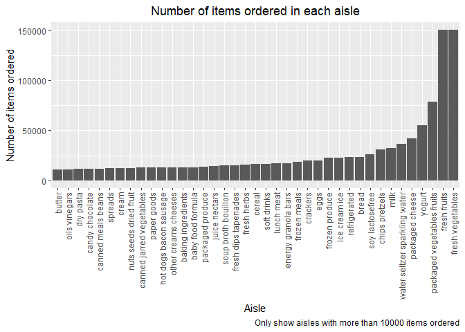

p8105_hw3_yf2605
================
Yi_Fang
2022-10-08

# Setting

libraries

``` r
library(tidyverse)
```

    ## ── Attaching packages ─────────────────────────────────────── tidyverse 1.3.2 ──
    ## ✔ ggplot2 3.3.6      ✔ purrr   0.3.4 
    ## ✔ tibble  3.1.8      ✔ dplyr   1.0.10
    ## ✔ tidyr   1.2.0      ✔ stringr 1.4.1 
    ## ✔ readr   2.1.2      ✔ forcats 0.5.2 
    ## ── Conflicts ────────────────────────────────────────── tidyverse_conflicts() ──
    ## ✖ dplyr::filter() masks stats::filter()
    ## ✖ dplyr::lag()    masks stats::lag()

picture display setting

``` r
knitr::opts_chunk$set(
  fig.width = 6,
  fig.asp = .6,
  out.width = "90%"
)
```

# Problem 1

## load Instacart data

``` r
library(p8105.datasets)
data("instacart")
```

## Description:

The Instacart dataset contains 15 variables and 1384617 records.

The variables include: order_id, product_id, add_to_cart_order,
reordered, user_id, eval_set, order_number, order_dow,
order_hour_of_day, days_since_prior_order, product_name, aisle_id,
department_id, aisle, department

## Questions:

-   How many aisles are there, and which aisles are the most items
    ordered from?

``` r
n_aisles = 
  instacart %>% 
  distinct(aisle) %>% 
  nrow()

most_item_aisle = 
  instacart %>% 
  group_by(aisle) %>% 
  summarize(n_items = n()) %>% 
  slice(which.max(n_items))
```

134 aisles are there, and fresh vegetables aisle is where the most items
ordered from.

-   Make a plot that shows the number of items ordered in each aisle,
    limiting this to aisles with more than 10000 items ordered. Arrange
    aisles sensibly, and organize your plot so others can read it.

``` r
instacart %>% 
  group_by(aisle) %>% 
  summarize(n_items = n()) %>% 
  filter(n_items > 10000) %>% 
  mutate(aisle = forcats::fct_reorder(aisle, n_items)) %>% 
  ggplot(aes(aisle, y = n_items)) +
  geom_col() +
  theme(axis.text.x = element_text(angle = 90, vjust = 0.5, hjust=1))
```



-   Make a table showing the three most popular items in each of the
    aisles “baking ingredients”, “dog food care”, and “packaged
    vegetables fruits”. Include the number of times each item is ordered
    in your table.

``` r
instacart %>% 
  group_by(aisle, product_name) %>% 
  summarize(n_items = n()) %>% 
  filter(aisle %in% c('baking ingredients', 'dog food care', 'packaged vegetables fruits')) %>% 
  arrange(desc(n_items)) %>% 
  slice(1:3) %>% 
  knitr::kable()
```

    ## `summarise()` has grouped output by 'aisle'. You can override using the
    ## `.groups` argument.

| aisle                      | product_name                                  | n_items |
|:---------------------------|:----------------------------------------------|--------:|
| baking ingredients         | Light Brown Sugar                             |     499 |
| baking ingredients         | Pure Baking Soda                              |     387 |
| baking ingredients         | Cane Sugar                                    |     336 |
| dog food care              | Snack Sticks Chicken & Rice Recipe Dog Treats |      30 |
| dog food care              | Organix Chicken & Brown Rice Recipe           |      28 |
| dog food care              | Small Dog Biscuits                            |      26 |
| packaged vegetables fruits | Organic Baby Spinach                          |    9784 |
| packaged vegetables fruits | Organic Raspberries                           |    5546 |
| packaged vegetables fruits | Organic Blueberries                           |    4966 |

-   Make a table showing the mean hour of the day at which Pink Lady
    Apples and Coffee Ice Cream are ordered on each day of the week;
    format this table for human readers (i.e. produce a 2 x 7 table).

``` r
instacart %>% 
  group_by(order_dow, product_name) %>% 
  summarize(mean_hour = mean(order_hour_of_day, na.rm=TRUE)) %>% 
  filter(product_name %in% c('Pink Lady Apples', 'Coffee Ice Cream')) %>% 
  pivot_wider(
    names_from = order_dow,
    values_from = mean_hour
  ) %>% 
  knitr::kable(digits = 2)
```

    ## `summarise()` has grouped output by 'order_dow'. You can override using the
    ## `.groups` argument.

| product_name     |     0 |     1 |     2 |     3 |     4 |     5 |     6 |
|:-----------------|------:|------:|------:|------:|------:|------:|------:|
| Coffee Ice Cream | 13.77 | 14.32 | 15.38 | 15.32 | 15.22 | 12.26 | 13.83 |
| Pink Lady Apples | 13.44 | 11.36 | 11.70 | 14.25 | 11.55 | 12.78 | 11.94 |

# Problem 2

Accelerometers have become an appealing alternative to self-report
techniques for studying physical activity in observational studies and
clinical trials, largely because of their relative objectivity. During
observation periods, the devices measure “activity counts” in a short
period; one-minute intervals are common. Because accelerometers can be
worn comfortably and unobtrusively, they produce around-the-clock
observations.

This problem uses five weeks of accelerometer data collected on a 63
year-old male with BMI 25, who was admitted to the Advanced Cardiac Care
Center of Columbia University Medical Center and diagnosed with
congestive heart failure (CHF). The data can be downloaded here. In this
spreadsheet, variables activity.\* are the activity counts for each
minute of a 24-hour day starting at midnight.

Load, tidy, and otherwise wrangle the data. Your final dataset should
include all originally observed variables and values; have useful
variable names; include a weekday vs weekend variable; and encode data
with reasonable variable classes. Describe the resulting dataset
(e.g. what variables exist, how many observations, etc). Traditional
analyses of accelerometer data focus on the total activity over the day.
Using your tidied dataset, aggregate across minutes to create a total
activity variable for each day, and create a table showing these totals.
Are any trends apparent? Accelerometer data allows the inspection
activity over the course of the day. Make a single-panel plot that shows
the 24-hour activity time courses for each day and use color to indicate
day of the week. Describe in words any patterns or conclusions you can
make based on this graph.

# Problem 3

This problem uses the NY NOAA data. DO NOT include this dataset in your
local data directory; instead, load the data from the p8105.datasets
package using:

``` r
library(p8105.datasets)
data("ny_noaa")
```

The goal is to do some exploration of this dataset. To that end, write a
short description of the dataset, noting the size and structure of the
data, describing some key variables, and indicating the extent to which
missing data is an issue. Then, do or answer the following (commenting
on the results of each):

Do some data cleaning. Create separate variables for year, month, and
day. Ensure observations for temperature, precipitation, and snowfall
are given in reasonable units. For snowfall, what are the most commonly
observed values? Why? Make a two-panel plot showing the average max
temperature in January and in July in each station across years. Is
there any observable / interpretable structure? Any outliers? Make a
two-panel plot showing (i) tmax vs tmin for the full dataset (note that
a scatterplot may not be the best option); and (ii) make a plot showing
the distribution of snowfall values greater than 0 and less than 100
separately by year.
